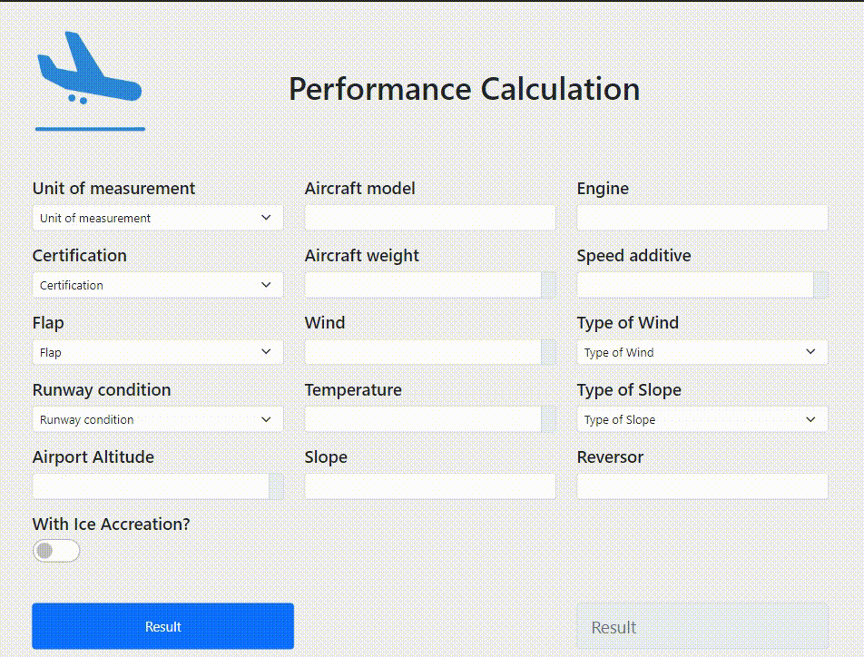
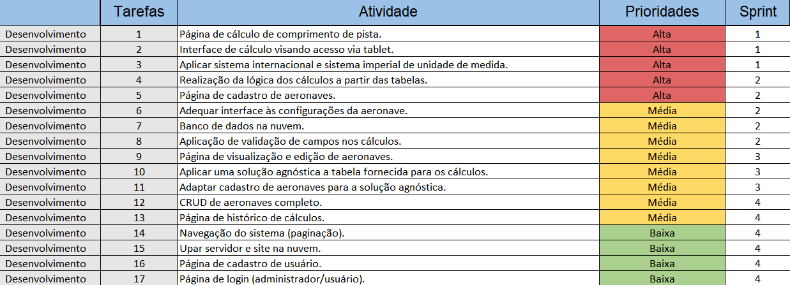

 

<h1> EQUIPE APOLO - APRENDIZAGEM POR PROJETOS INTEGRADOS 3º SEMESTRE ADS - 2022 </h1>

    <a href="#objetivo">Objetivo</a> | 
    <a href="#requisitos">Requisitos</a> | 
    <a href="#relatório">Relatório</a> | 
    <a href="#projeto">Resultado</a> |
    <a href="#tecnologias">Tecnologias</a> | 
    <a href="#equipe">Equipe</a> | 

<h2> :dart: Objetivo</h2>

 O projeto tem como finalidade criar uma interface para que os pilotos de aeronaves possam, a partir dos parâmetros considerados, calcular a distância necessária para realizar o pouso de forma segura. Para tal cálculo, uma tabela foi disponibilizada para que todos os fatores sejam levados em consideração. Tais fatores são: modelo, motor, certificação, peso e flap de pouso da aeronave, altitude do aeroporto, temperatura, vento, inclinação da pista, uso de reversor, aditivo de velocidade, acúmulo de gelo, condição de pista e nível de aplicação de frenagem.

<h2> :bookmark_tabs: Requisitos Funcionais </h2>

- [x] Cadastros de modelos de aeronaves;
- [x] Perfis diferentes (administrador, usuário);
- [x] Interface amigável para cálculo de perfomace via celular ou tablet;
- [x] Gerar cálculo do comprimento mínimo da pista de pouso pelos fatores considerados;
- [x] Gerar histórico dos cálculos realizados;

<h3> Requisitos Não Funcionais </h3>

- [x] Linguagem Typescript;
- [x] Documentações;
 

 → [Voltar ao topo](#topo)
    
 ## Entregas 

<h4> Entrega da Sprint 1 </h4>

 

<h4> Entrega da Sprint 2 </h4>

 

<h4> Entrega da Sprint 3 </h4>

 

<h4> Entrega da Sprint 4 </h4>

 

 
    

 
 ## :clipboard: Relatórios
Na tabela abaixo é possível visualizar os resultados de cada Sprint clicando em "Ver relatório". 
    
| Sprint | Entrega | Status | Relatório |
|:-----:|:----------:|:---------:|:---------:|
| 01 | 18/09/2022 | :heavy_check_mark:	 | [ver relatório](https://github.com/EquipeApolo/API_3_Semestre/blob/main/relatorios/1sprint.md) |
| 02 | 09/10/2022 | :heavy_check_mark:	 | [ver relatório](https://github.com/EquipeApolo/API_3_Semestre/blob/main/relatorios/sprint2.md) |
| 03 | 06/11/2022 | :heavy_check_mark:	 | [ver relatório](https://github.com/EquipeApolo/API_3_Semestre/blob/main/relatorios/sprint3.md) |
| 04 | 27/11/2022 | :clock12:	 | ver relatório |
 

    
 
    
 
 ## 📌 Backlog Priorizado
    

 

 
 ## 📆 Sprints
Na tabela abaixo é possível visualizar a divisão de tarefas do Backlog por Sprints.

| Sprint | Atividade | Status |
|:-----:|:---------:|:---------:|
| 01 | Página de cálculo do comprimento de pista. | :heavy_check_mark: |
| 01 | Interface de cálculo visando acesso via tablet. | :heavy_check_mark: |
| 01 | Aplicar sistemas de unidade de medida. | :heavy_check_mark: |
| 02 | Página de cadastro de aeronaves. | :heavy_check_mark: |
| 02 | Realização da lógica dos cálculos a partir das tabelas. | :heavy_check_mark: |
| 02 | Adequar interface às configurações da aeronave. | :heavy_check_mark: |
| 02 | Banco de dados na nuvem. | :heavy_check_mark: |
| 02 | Aplicação de validação de campos nos cálculos. | :heavy_check_mark: |
| 03 | Página de visualização e edição de aeronaves. | :heavy_check_mark: |
| 03 | Aplicar uma solução agnóstica a tabela fornecida para os cálculos. | :heavy_check_mark: |
| 03 | Adaptar cadastro de aeronaves para a solução agnóstica. | :heavy_check_mark: |
| 03 | CRUD de aeronaves completo. | :heavy_check_mark: |
| 04 | CRUD de flaps completo. | :clock12: | 
| 04 | Páginas de visualização, cadastro e edição de flaps. | :clock12: |
| 04 | Página de histórico de cálculos. | :clock12: |
| 04 | Ajuste nas unidades de medida da página de cálculo. | :clock12: |
| 04 | CRUD de usuários completo. | :clock12: |
| 04 | Página de visualização, cadastro e edição de usuários. | :clock12: |
| 04 | Upar servidor na nuvem. | :clock12: |
| 04 | Navegação do sistema administrativo (paginação). | :clock12: |
| 04 | Página de login. | :clock12: |
| 04 | Documentação para explicação e how-to da solução agnóstica apresentada. | :clock12: |
 
 

 
## 👩‍💻 Equipe
|Função|Nome|GitHub|LinkedIn|
| -------- |-------- |-------- |-------- |
| Scrum Master |Jeniffer Cristina Freitas Pereira|||
| Product Owner |Thales de Lucca Kerber| ||
| Developer |Ana Carolina das Neves|||
| Developer |Davi Silvestre|||
| Developer |Mateus Silva| ||
| Developer |Gustavo Lobato| ||
| Developer |Diego Batista| ||
 

''

## 🛠️ Tecnologias

Foram usadas as seguintes ferramentas, linguagens e tecnologias para a execução do projeto:

- [HTML5 & CSS3](https://www.w3schools.com/): Linguagens de marcação
- [Typescript](https://www.typescriptlang.org/): Linguagem de programação
- [Git](https://git-scm.com): Versionamento
- [GitHub](https://github.com/): Armazenamento de código
- [Teams](https://teams.microsoft.com): Comunicação
- [Whimsical](https://whimsical.com): Prototipagem
- [Node](https://nodejs.org/): Runtime
- [React](https://pt-br.reactjs.org/): Framework

→ [Voltar ao topo](#topo)

 

 <h1 align="center"> 
  
