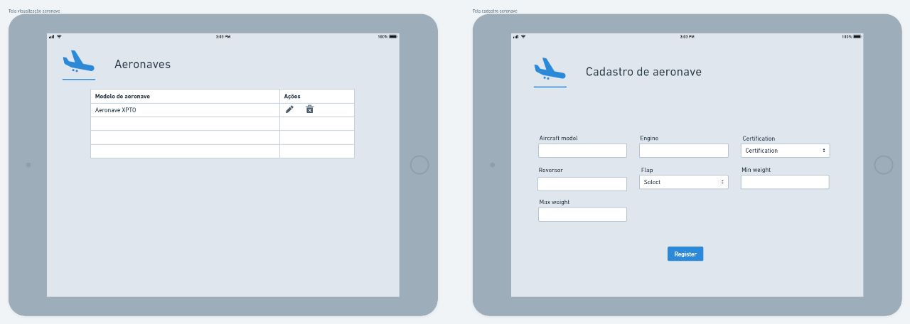

 
 
<h1 align="center"> SPRINT 3 :ballot_box_with_check: </h1>

    <a href="#mvp">MVP</a> | 
    <a href="#burndown">Burndown</a> | 
    <a href="#entrega">Entrega</a> | 

 
<h1> :rocket: MVP </h1>

Nesta sprint, desenvolveu-se a página de visualização e edição de aeronaves, além da aplicação de uma solução agnóstica (de acordo com a tabela fornecida para os cálculos) agrupando a adaptação do respectivo cadastro de aeronaves.

  
  
 <h3 align="center"> WIREFRAME </h3>

 

 
  

 
## :pushpin: Burndown

 

 

  
 
 
## 👩‍💻 Entrega

 

 
   
  → [Voltar ao topo](#topo)
<h1 align="center"> 
<h5 align="center"> Projeto Integrador - Faculdade de Tecnologia de São José dos Campos - Prof. Jessen Vidal </h5>
