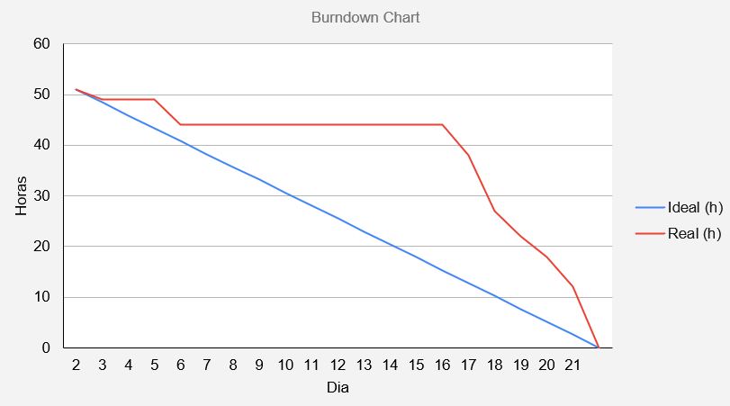

 
 
<h1 align="center"> SPRINT 4 :ballot_box_with_check: </h1>

    <a href="#mvp">MVP</a> | 
    <a href="#burndown">Burndown</a> | 
    <a href="#entrega">Entrega</a> | 

 
<h1> :rocket: MVP </h1>

Nesta sprint, desenvolveu-se o CRUD completo de usuários (inserção, atualização, remoção e consulta na página apropriada), juntamente com a tela de login para promover o controle de acesso. Além disso, criou-se uma página responsável pela demonstração dos históricos de cálculos realizados. Ademais, para tornar a navegação do site mais prática e eficiente, adaptou-se a navegação do sistema administrativo por meio das paginações, onde possibilita trocar de páginas por atalhos fixos e específicas. Por fim, tendo como base a proposta de solução agnóstica, produziu-se a documentação para explicação e how-to da solução apresentada que indica todas as etapas a serem seguidas para adicionar um novo parâmetro.

  
  
 
  

 
## :pushpin: Burndown

 

 

  
 
 
## 👩‍💻 Entrega

 

 
   
  → [Voltar ao topo](#topo)
<h1 align="center"> 
<h5 align="center"> Projeto Integrador - Faculdade de Tecnologia de São José dos Campos - Prof. Jessen Vidal </h5>
